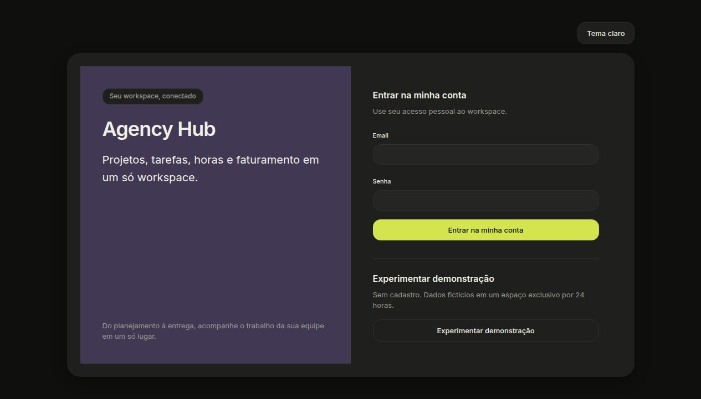
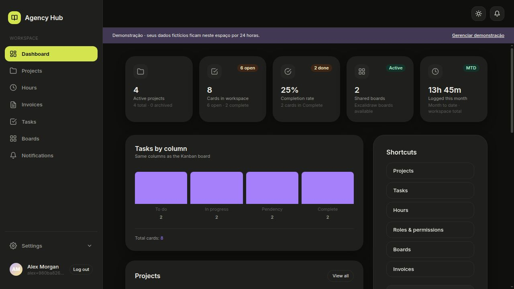
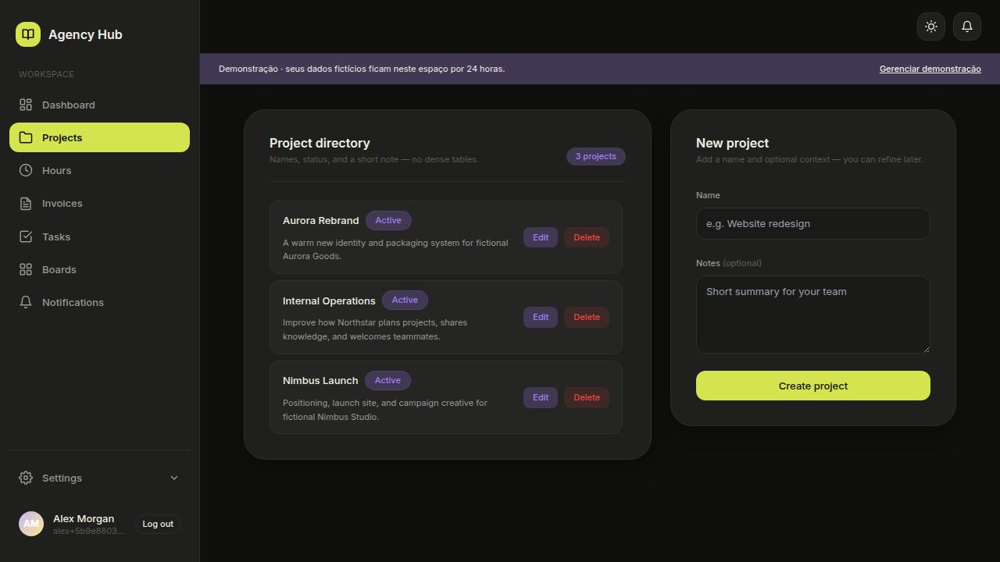
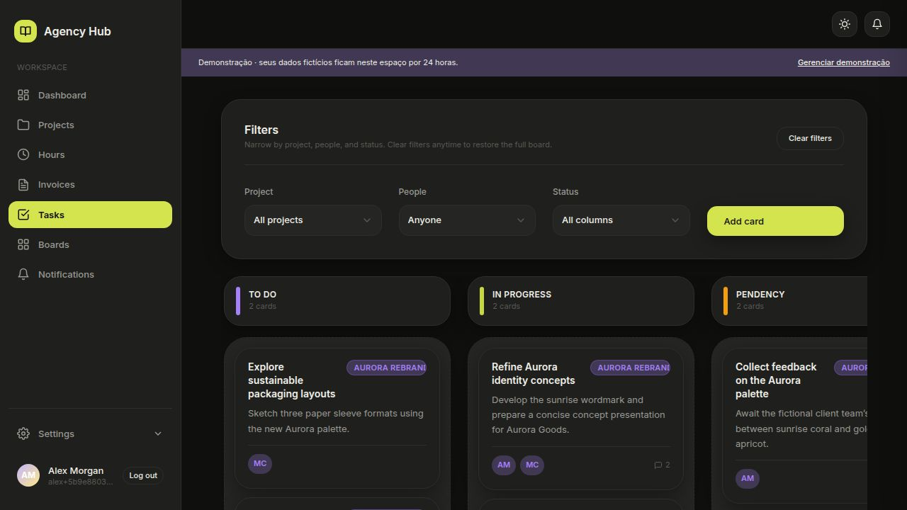
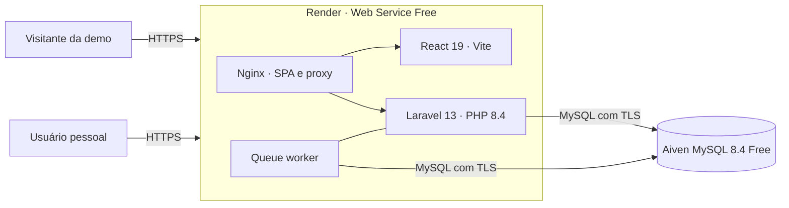
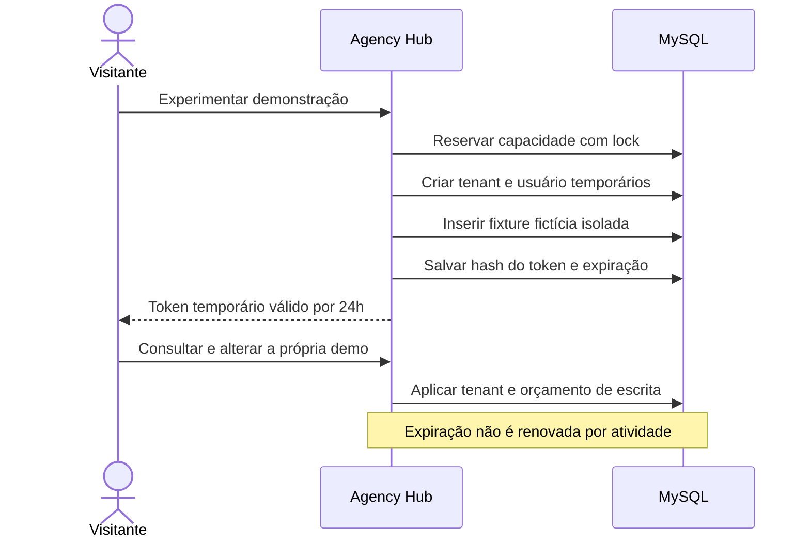

# Agency Hub

### Projetos, tarefas, horas e faturamento em um só workspace.

Dashboard · Projetos · Kanban · Horas · Faturas · Boards · Notificações · RBAC

Uma central colaborativa para agências organizarem o trabalho do briefing à entrega, construída como um projeto full stack de portfólio.

[Experimentar demonstração →](https://agency-hub-bf8l.onrender.com) · [Rodar com Docker](#rodar-com-docker) · [Galeria](#galeria) · [Deploy gratuito](#publicação-online)

React 19 · Laravel 13 · **PHP 8.4 runtime** · MySQL 8.4 · Docker

## Sobre o projeto

O Agency Hub reúne o que uma equipe de agência consulta todos os dias: projetos em andamento, tarefas distribuídas por etapa, horas registradas, faturas, boards visuais e permissões do workspace. A proposta é evitar que o contexto de uma entrega fique espalhado entre várias ferramentas.

A aplicação inclui SPA responsiva, API REST, persistência relacional, autenticação por sessão, RBAC multi-tenant, notificações, documentação OpenAPI, testes e operação em Docker. A publicação deste README usa uma única imagem no Render e um MySQL gerenciado no Aiven, ambos em planos gratuitos.

A demonstração é interativa. Cada visitante recebe um workspace exclusivo, com dados fictícios e validade absoluta de 24 horas — a `24-hour demo` documentada pelo projeto. Alterações persistem durante a sessão sem aparecer para outros visitantes.

### Navegue pelo README

- [Experimentar em cinco minutos](#experimentar-em-cinco-minutos)
- [Galeria de telas](#galeria)
- [Funcionalidades](#funcionalidades)
- [Decisões de engenharia](#decisões-de-engenharia)
- [Arquitetura e tecnologias](#arquitetura-e-tecnologias)
- [Como a demonstração funciona](#como-a-demonstração-funciona)
- [Rodar com Docker](#rodar-com-docker)
- [Desenvolvimento e testes](#desenvolvimento-e-testes)
- [Publicação online](#publicação-online)
- [Estrutura do repositório](#estrutura-do-repositório)

## Experimentar em cinco minutos

Abra a [demonstração online](https://agency-hub-bf8l.onrender.com) e clique em **Experimentar demonstração**. Não é necessário cadastro, e-mail ou senha pública.

1. **Dashboard:** veja projetos ativos, distribuição das tarefas, boards compartilhados e horas do mês.
2. **Projects:** abra o diretório, crie um projeto fictício e recarregue a página para conferir a persistência.
3. **Tasks:** filtre por projeto, pessoa ou coluna; abra um card para explorar detalhes, responsáveis, subtarefas e comentários.
4. **Hours:** inicie um cronômetro ou registre uma entrada manual vinculada a uma tarefa.
5. **Invoices:** acompanhe faturas em rascunho, enviadas e pagas.
6. **Boards:** explore os quadros colaborativos disponíveis no workspace.
7. **Settings:** consulte usuários, funções e permissões ou reinicie apenas a sua própria demonstração.

> A instância gratuita pode precisar despertar após um período sem acessos. A primeira abertura e a preparação do workspace podem levar alguns segundos. A sessão expira após 24 horas.

## Galeria

Prints reais da aplicação publicada, capturados em 13 de setembro de 2026. Todos os nomes, e-mails, projetos e tarefas exibidos são fictícios.

### Entrada e visão geral

A mesma entrada separa o acesso pessoal da demonstração temporária. O dashboard resume o estado operacional do workspace.

<p align="center">
  <a href="docs/screenshots/login.jpg"></a>
  <a href="docs/screenshots/dashboard.jpg"></a>
</p>

### Projetos e execução

O diretório mantém o contexto de cada iniciativa. A central de tarefas organiza os cards nas mesmas etapas usadas pelo Kanban.

<p align="center">
  <a href="docs/screenshots/projects.jpg"></a>
  <a href="docs/screenshots/tasks.jpg"></a>
</p>

## Funcionalidades

| Área | O que é possível fazer |
| --- | --- |
| Dashboard | Consultar projetos ativos, tarefas abertas e concluídas, boards, horas do mês e atividade recente. |
| Projetos | Criar, editar, arquivar e excluir projetos com contexto compartilhado para a equipe. |
| Tarefas | Criar cards, mover entre etapas, atribuir pessoas, usar subtarefas, comentários e anexos. |
| Horas | Iniciar e encerrar sessões, lançar horas manualmente, filtrar registros e exportar relatórios. |
| Faturas | Criar faturas, atualizar dados e status e registrar o fluxo de envio. |
| Boards | Criar e editar quadros visuais colaborativos vinculados ao workspace. |
| Notificações | Consultar eventos, marcar itens como lidos e gerenciar preferências. |
| Equipe e RBAC | Administrar usuários, funções e permissões explícitas por operação. |
| Demonstração | Entrar sem cadastro em um workspace fictício, isolado e descartável por 24 horas. |

## Decisões de engenharia

| Problema | Solução implementada |
| --- | --- |
| Demonstrar o produto sem compartilhar uma conta pública | Um tenant e um usuário novos são criados para cada visitante, com token aleatório armazenado no banco somente como hash. |
| Evitar vazamento entre workspaces | O tenant autenticado é aplicado pela API, e todas as relações sensíveis são validadas no servidor. |
| Limitar abuso da demonstração | Criação com rate limit e limite global de sessões; cada demo também possui orçamento máximo de escrita. |
| Garantir expiração real | O vencimento absoluto é gravado no tenant e no token. A atividade não renova as 24 horas. |
| Limpar sem infraestrutura paga adicional | Sessões expiradas são removidas oportunisticamente e também por comando agendável, sem exigir um worker separado. |
| Proteger arquivos e integrações | Uploads e ações externas ficam bloqueados em demos; armazenamento do Render é tratado como efêmero. |
| Manter o deploy sem cobrança | O Blueprint aceita somente um Web Service `free`, sem disco, cron, worker ou banco pago no Render. Um validador falha se essa forma mudar. |
| Conectar MySQL pela internet com segurança | A conexão usa TLS e o certificado CA do Aiven, validado e materializado apenas no runtime do container. |

## Arquitetura e tecnologias

O Agency Hub é um monólito modular: o React compilado e a API Laravel são servidos pela mesma origem. Isso elimina CORS desnecessário no navegador e permite operar toda a demonstração em um único Web Service.



| Camada | Tecnologias |
| --- | --- |
| Frontend | React 19, Vite 8, React Router, TanStack Query, Tailwind CSS e componentes próprios. |
| Backend | Laravel 13, PHP 8.4, Sanctum, filas e API REST versionada. |
| Dados | MySQL 8.4, migrações Laravel, UUIDs públicos e escopo multi-tenant. |
| Interface colaborativa | Excalidraw para boards, Kanban, comentários, subtarefas e notificações. |
| Entrega | Docker multi-stage, Nginx, PHP-FPM, Supervisor e health check. |
| Qualidade | PHPUnit, Vitest, Testing Library, ESLint, Pint e validadores de infraestrutura. |

## Como a demonstração funciona



Não existe uma senha pública compartilhada. O token fica apenas no `sessionStorage` daquela aba, é enviado como Bearer nas chamadas da demo e não substitui silenciosamente uma sessão pessoal. Ao expirar, o acesso é recusado; novas entradas limpam parte dos workspaces vencidos.

## Rodar com Docker

Pré-requisito: Docker com o plugin Docker Compose.

```bash
git clone https://github.com/Hugueninfer/agency-hub.git
cd agency-hub
docker compose up -d --build
```

Abra [http://127.0.0.1:8080](http://127.0.0.1:8080) e escolha **Experimentar demonstração**. O container espera o MySQL ficar saudável, aplica as migrações e inicia Nginx, PHP-FPM e o worker.

Comandos úteis:

```bash
# Ver os serviços e o health check
docker compose ps
curl --fail http://127.0.0.1:8080/api/health

# Acompanhar logs
docker compose logs -f app

# Parar sem apagar os volumes
docker compose stop
```

`docker compose down -v` remove os bancos e uploads locais. Não execute esse comando se quiser preservar os dados.

## Desenvolvimento e testes

O caminho reproduzível é Docker; para trabalhar fora dele, use PHP 8.4, Composer 2, Node 22+ e MySQL 8.4.

```bash
# Backend
cd api
composer install
php artisan test

# Frontend
cd ../web
npm ci
npm test
npm run lint
npm run build
```

Da raiz, os dois gates principais também podem ser executados diretamente:

```bash
(cd api && composer install && php artisan test)
(cd web && npm ci && npm test)
```

Validações específicas do deploy gratuito:

```bash
bash scripts/test-validate-render-free.sh
bash scripts/validate-render-free.sh
bash scripts/test-bootstrap-aiven-ca.sh
bash scripts/test-start-aiven-ca-gate.sh
```

Os testes cobrem autenticação, isolamento multi-tenant, RBAC, projetos, tarefas, horas, faturas, notificações, validade da demo, limites de escrita, concorrência e integração com MySQL.

## Publicação online

A instalação deste README está em [agency-hub-bf8l.onrender.com](https://agency-hub-bf8l.onrender.com).

- **Aplicação:** um Web Service Docker no plano Render Free.
- **Banco:** Aiven MySQL Free, 1 GB, conectado com verificação TLS.
- **Cobrança:** nenhum cartão foi adicionado ao workspace usado nesta publicação.
- **Deploy automático:** desativado para o serviço; novas versões são promovidas deliberadamente.
- **Segredos:** `APP_KEY`, credenciais MySQL e CA ficam somente nos painéis protegidos dos provedores.

O arquivo [`render.yaml`](render.yaml) descreve apenas a forma gratuita aceita. O script [`scripts/validate-render-free.sh`](scripts/validate-render-free.sh) bloqueia planos pagos, discos, workers, cron jobs e outros recursos fora desse desenho. O passo a passo completo está em [`docs/operations/render.md`](docs/operations/render.md).

Planos gratuitos têm limites, suspensão por inatividade e não oferecem garantia de disponibilidade. O primeiro acesso pode sofrer cold start. A base Aiven Free tem 1 GB, e o filesystem do Render é efêmero; esta publicação é uma demonstração, não um ambiente de produção ou backup.

## Estrutura do repositório

```text
agency-hub/
├── api/                    # Laravel, domínio, API, migrações e testes
├── web/                    # React, páginas, componentes e testes
├── docker/                 # Supervisão e runtime do container
├── docs/
│   ├── operations/         # Runbook de publicação e operação
│   └── screenshots/        # Prints reais usados neste README
├── scripts/                # Gates de segurança e validação do deploy
├── Dockerfile              # Build multi-stage frontend + backend
├── compose.yaml            # Ambiente local com MySQL persistente
└── render.yaml             # Blueprint gratuito da publicação
```

## Segurança e limites atuais

- Não use a demonstração para dados pessoais, sigilosos ou insubstituíveis.
- Uploads ficam desativados em sessões demo (`demo uploads are blocked`).
- Contas pessoais e demos compartilham a instalação, mas são separadas por tenant e identidade autenticada.
- O banco gratuito é acessível pela internet somente com usuário, senha e TLS; as credenciais não estão no Git.
- A limpeza de demos expiradas é eventual, mas o acesso é negado assim que o prazo termina.
- A aplicação não promete alta disponibilidade, retenção de arquivos ou recuperação de desastre no plano gratuito.

## Licença

Distribuído sob a licença MIT declarada em [`api/composer.json`](api/composer.json).

Código: [github.com/Hugueninfer/agency-hub](https://github.com/Hugueninfer/agency-hub) · [Issues](https://github.com/Hugueninfer/agency-hub/issues)
