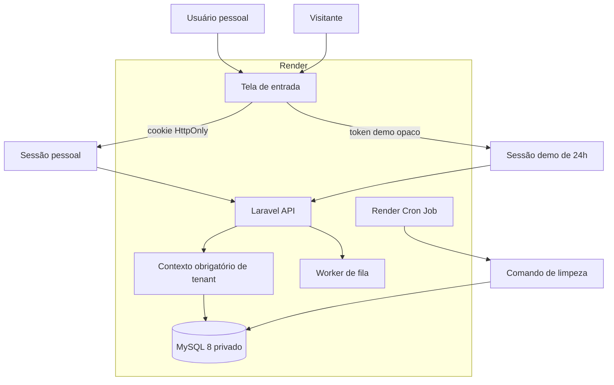

# Agency Hub — demonstração isolada e publicação no Render

Data: 2026-09-06

## Objetivo

Criar um novo produto de portfólio chamado **Agency Hub** a partir do código atual do Workflow, sem alterar o repositório `Hugueninfer/workflow`, seu histórico, seu banco ou sua publicação no Railway.

O novo repositório `Hugueninfer/agency-hub` será público e terá uma instalação independente no Render. A tela de entrada oferecerá autenticação pessoal e uma demonstração interativa. Cada visitante da demonstração receberá um workspace próprio, preenchido com dados fictícios, editável por 24 horas e isolado de todos os demais workspaces.

## Limites do trabalho

### Incluído

- Novo repositório Git, sem histórico do Workflow.
- Renomeação pública do produto para Agency Hub.
- Publicação Docker no Render.
- MySQL 8 exclusivo da instalação do Render.
- Modo combinado: conta pessoal e demonstração.
- Dados fictícios versionados e criados por visitante.
- Expiração, encerramento, restauração e limpeza de demos.
- Limites de uso contra abuso.
- Testes de isolamento, autenticação, expiração e limpeza.
- README de portfólio inspirado na estrutura do Orbit.
- Capturas reais da aplicação publicada.

### Excluído

- Qualquer mudança no repositório `Hugueninfer/workflow`.
- Qualquer mudança no deploy ou banco do Railway.
- Migração de dados do Railway.
- Cadastro público de contas pessoais.
- Compartilhamento de uma conta demo ou de um tenant demo entre visitantes.
- Dependência entre os ambientes Railway e Render.

## Alternativas consideradas

### 1. Instalações e bancos independentes — escolhida

O Agency Hub recebe código, histórico, serviço web e MySQL próprios. Essa opção elimina o risco de uma demonstração afetar o Workflow e permite evoluir a apresentação do portfólio sem mudar a aplicação original.

### 2. Repositórios separados com banco compartilhado — rejeitada

Reduziria a quantidade de infraestrutura, mas manteria acoplamento operacional, permitiria que erros da demo afetassem o ambiente existente e exigiria acesso externo ao banco do Railway.

### 3. Substituir o Workflow pelo Agency Hub — rejeitada

Simplificaria a quantidade de deploys, mas destruiria a separação solicitada e aumentaria o risco de regressão no ambiente já publicado.

## Arquitetura

O frontend React e a API Laravel continuarão servidos pela mesma origem através da imagem Docker atual. O serviço web será público; o MySQL será um serviço privado, acessível apenas dentro do workspace do Render. O sistema usará `APP_MODE=combined` para habilitar os dois fluxos de identidade.

O deploy do Agency Hub não conhecerá credenciais, URL interna ou identificadores do ambiente Railway.

## Modelo de identidade

### Conta pessoal

O login existente por e-mail e senha continuará usando sessão Laravel com cookie HttpOnly, `Secure` e `SameSite=Lax`. Não haverá cadastro público. Uma conta pessoal de administração poderá ser criada por comando operacional, com senha informada de forma segura no ambiente do Render.

### Demonstração

`POST /api/v1/auth/demo` não aceitará e-mail nem senha. A operação:

1. remove demos expiradas em um lote limitado;
2. verifica o limite global de demos ativas;
3. cria um tenant marcado como demonstração;
4. cria um usuário proprietário associado ao tenant;
5. cria um token aleatório criptograficamente seguro;
6. armazena apenas o SHA-256 do token;
7. copia a fixture fictícia dentro de uma transação;
8. retorna o token e `expires_at`.

O token ficará em `sessionStorage`, não em `localStorage`, e será enviado como `Authorization: Bearer`. A expiração será definida pelo servidor em UTC e terá duração padrão de 24 horas.

### Precedência de credenciais

Quando a requisição contiver `Authorization`, a API validará exclusivamente a credencial demo. Um token demo inválido ou expirado nunca poderá cair silenciosamente para uma sessão pessoal presente no navegador. Sem `Authorization`, a API seguirá o fluxo de cookie pessoal.

Essa regra será implementada antes do middleware de tenant e substituirá o comportamento ambíguo de autenticação combinada nas rotas protegidas.

## Modelo de dados

### Alterações em `tenants`

- `kind`: `personal` ou `demo`, com padrão `personal`.
- `expires_at`: timestamp UTC anulável e indexado.
- `demo_write_count`: inteiro não negativo, com padrão zero.

Um tenant pessoal sempre terá `expires_at = null`. Um tenant demo sempre terá `expires_at` preenchido.

### Nova tabela `demo_tokens`

- `digest`: hash SHA-256 como chave única.
- `tenant_id`: chave estrangeira com exclusão em cascata.
- `user_id`: chave estrangeira com exclusão em cascata.
- `expires_at`: timestamp UTC indexado.
- `created_at` e `updated_at`.

O token em texto puro nunca será persistido ou registrado em logs.

### Integridade do tenant

Todos os agregados acessíveis pela API permanecem associados a `tenant_id`. O middleware resolve o tenant a partir da identidade autenticada. Requests, services e repositories não aceitam `tenant_id` enviado pelo cliente.

Antes da publicação, as relações atuais serão auditadas para garantir cascata a partir do tenant. As tabelas que dependem apenas de usuários ou tarefas serão removidas indiretamente por suas chaves estrangeiras. Relações sem cascata serão corrigidas por migration explícita ou removidas em ordem determinística pelo serviço de limpeza.

## Fixture da demonstração

A base fictícia será uma fixture versionada, imutável e específica do Agency Hub. Ela conterá, no mínimo:

- empresa fictícia com identidade visual segura para portfólio;
- dois ou mais usuários fictícios com papéis distintos;
- projetos ativos e concluídos;
- tarefas em todas as colunas do Kanban;
- subtarefas, comentários e atribuições;
- lançamentos de horas e uma sessão de timer utilizável;
- invoices em estados diferentes e seus itens;
- boards com conteúdo visual de exemplo;
- notificações e preferências;
- configurações de menu e permissões.

Ao criar uma demo, UUIDs e vínculos serão regenerados. Datas relativas serão recalculadas a partir do instante de criação para que dashboard, prazos, horas e invoices nunca pareçam desatualizados. Nenhum dado, marca, domínio, e-mail ou arquivo do ambiente real será usado.

A cópia da fixture será transacional: qualquer falha remove toda a demo parcialmente criada.

## Limites e proteção contra abuso

Valores padrão, configuráveis por ambiente:

- `DEMO_TTL_HOURS=24`;
- `DEMO_MAX_ACTIVE=100`;
- `DEMO_MAX_WRITES=5000` por tenant;
- rate limit do endpoint de criação por IP;
- limite de tamanho e quantidade de anexos;
- integrações externas e envio real de e-mail desativados para demos.

O contador de gravações será monotônico. Exclusões feitas pelo visitante não devolverão cota. A restauração explícita da própria demo poderá zerar o contador após apagar seus dados de domínio e recarregar a fixture.

Operações que ultrapassarem o limite retornarão HTTP 429 sem deixar alterações parciais.

## Lifecycle da demonstração

### Entrada

A tela de login terá dois caminhos visualmente separados:

- formulário de conta pessoal;
- cartão “Experimentar demonstração”, sem campos obrigatórios.

Durante a criação, o botão mostrará progresso e impedirá envios duplicados. Ao concluir, a interface armazenará a credencial temporária, carregará `/auth/me` e abrirá o dashboard.

### Uso

Um banner discreto informará que os dados são fictícios, exclusivos do visitante e válidos por 24 horas. A interface poderá mostrar o horário de expiração sem usar esse relógio como fonte de autorização.

### Restauração

`POST /api/v1/auth/demo/reset` apagará somente dados do tenant demo autenticado e recriará a fixture. Contas pessoais receberão 404 para essa rota. A ação exigirá confirmação visual.

### Saída

`POST /api/v1/auth/demo/logout` revogará apenas o token atual. O frontend apagará token, intenção de identidade e cache local antes de voltar ao login.

### Expiração e limpeza

Uma demo expirada receberá 401 em qualquer rota protegida, mesmo que os registros ainda não tenham sido fisicamente removidos. A remoção ocorrerá:

- oportunisticamente, em lote pequeno, antes de criar outra demo;
- por `php artisan demo:cleanup --limit=...` executado em um Render Cron Job.

A limpeza será idempotente, terá trava para evitar execuções concorrentes e excluirá tenants completos dentro de transações curtas.

## API

Novos endpoints:

| Método | Rota | Autenticação | Resultado |
|---|---|---|---|
| `GET` | `/api/v1/config` | pública | modo da aplicação e disponibilidade da demo |
| `POST` | `/api/v1/auth/demo` | pública + rate limit | token opaco e expiração |
| `POST` | `/api/v1/auth/demo/reset` | demo | restaura somente o tenant atual |
| `POST` | `/api/v1/auth/demo/logout` | demo | revoga somente o token atual |

`GET /api/v1/auth/me` passará a incluir `is_demo` e `expires_at`. As respostas manterão o envelope atual `{ success, message, data, errors }`.

## Interface

A nova entrada seguirá os tokens visuais existentes em vez de copiar os estilos do Orbit. A referência do Orbit será usada para hierarquia e clareza do fluxo:

- proposta de valor curta;
- login pessoal claramente identificado;
- CTA forte para demonstração;
- texto explícito: sem cadastro, dados fictícios e expiração em 24 horas;
- estados de carregamento e erro acessíveis;
- layout responsivo e tema claro/escuro.

Usuários demo terão indicação persistente de modo demo. A opção de restauração ficará nas configurações. Funções capazes de gerar efeitos externos, como envio de invoices por e-mail e webhook Fathom real, serão bloqueadas no backend para tenants demo, não apenas ocultadas no frontend.

## Render

O repositório conterá `render.yaml` com:

- Web Service Docker `agency-hub`;
- Private Service MySQL 8;
- disco persistente montado em `/var/lib/mysql`;
- Cron Job para limpeza das demos;
- health check em `/api/health`;
- deploy automático desligado;
- segredos marcados como não sincronizados.

O container da aplicação continuará executando Nginx, PHP-FPM e o worker de fila sob Supervisor. O startup aplicará migrations de forma não interativa antes de liberar a aplicação. `APP_ENV=production`, `APP_DEBUG=false`, cookies seguros, HSTS e URLs HTTPS serão obrigatórios.

Como o MySQL no Render não é um datastore gerenciado, haverá procedimento de backup com `mysqldump`. Snapshots do disco não serão tratados como backup lógico recuperável.

Uploads persistentes exigirão disco próprio ou storage de objeto. Para o primeiro deploy de portfólio, a aplicação terá disco persistente em `/app/storage/app/public`; a documentação deixará claro que escalonamento horizontal exigirá storage de objeto compartilhado.

## Novo repositório

O código será copiado para um diretório irmão chamado `agency-hub`, sem reutilizar o diretório `.git` do Workflow. O novo histórico começará com commits próprios e auditáveis.

Antes do primeiro push:

- remover artefatos de cobertura, logs e arquivos de build sem valor para o produto;
- revisar `.gitignore` e `.dockerignore`;
- procurar segredos e credenciais no conteúdo e no índice;
- substituir referências públicas a Workflow por Agency Hub;
- manter exemplos de ambiente sem valores reais;
- executar testes e builds locais.

O repositório remoto será criado como `Hugueninfer/agency-hub`, público. O Workflow não receberá branches, tags, commits ou alterações de configuração.

## Testes e critérios de aceite

### Backend

- Duas demos criadas em sequência recebem tenants, usuários, tokens e registros diferentes.
- Uma demo não consulta nem altera UUIDs pertencentes a outra.
- Demo não consulta nem altera dados de conta pessoal.
- Token em texto puro não aparece no banco ou nos logs.
- Token expirado retorna 401 mesmo com cookie pessoal presente.
- Header `Authorization` inválido não recua para cookie pessoal.
- Criação parcial da fixture sofre rollback.
- Limite global e limite de gravações retornam 429.
- Reset altera somente o tenant autenticado.
- Logout revoga apenas o token atual.
- Cleanup remove expirados e preserva demos ativas e tenants pessoais.
- Envio externo de e-mail e Fathom são bloqueados para demos.

### Frontend

- Login pessoal continua funcionando.
- CTA demo funciona com e-mail e senha vazios.
- Duplo clique não cria duas demos.
- Reload preserva a demo válida dentro da aba.
- Expiração limpa o estado e volta ao login com mensagem adequada.
- Logout pessoal e logout demo usam rotas e estados corretos.
- Banner e restauração aparecem apenas para demos.
- Layout de entrada funciona em desktop e mobile.

### Entrega

- `npm run lint` e `npm run build` passam.
- Testes Laravel passam em MySQL dedicado.
- Imagem Docker constrói e inicia sem segredos no build.
- Health check responde depois das migrations.
- Render e Railway usam bancos diferentes.
- Nenhuma mudança existe no worktree ou histórico do Workflow.
- Screenshots do README são capturados da URL publicada do Agency Hub.

## README e galeria

O README seguirá a estrutura editorial do Orbit, adaptada ao Agency Hub:

1. nome, tagline e proposta de valor;
2. links para demo, API e execução local;
3. visão do produto;
4. roteiro de experimentação em poucos minutos;
5. galeria com prints reais ampliáveis;
6. funcionalidades por módulo;
7. decisões de engenharia;
8. arquitetura e tecnologias;
9. explicação da demo isolada;
10. Docker e desenvolvimento local;
11. configuração do Render;
12. testes, segurança, operação e backups;
13. estrutura do repositório e limites atuais.

Os prints serão capturados somente após o deploy validado, usando dados fictícios. A galeria incluirá login, dashboard, projetos, Kanban, board visual, horas, invoices e telas móveis representativas.

## Sequência de implementação

1. Criar o diretório e o repositório independente.
2. Higienizar e renomear a base copiada.
3. Escrever testes de identidade, isolamento e expiração.
4. Implementar schema, autenticação combinada e comandos de lifecycle.
5. Criar e versionar a fixture fictícia.
6. Adaptar cliente HTTP, contexto de autenticação e tela de login.
7. Bloquear efeitos externos para demos.
8. Criar e testar a configuração do Render.
9. Executar revisão de segurança e suíte completa.
10. Criar o repositório remoto e publicar o código.
11. Provisionar Render e MySQL sem tocar no Railway.
12. Validar a aplicação publicada e capturar screenshots.
13. Concluir o README e publicar a atualização documental.

## Operação e rollback

O primeiro deploy do Agency Hub será independente e não exigirá janela de manutenção do Workflow. Em caso de falha, o serviço Render poderá ser pausado ou revertido ao commit anterior sem qualquer ação no Railway.

Como o banco do Render começa vazio, migrations do Agency Hub não terão efeito sobre dados existentes. Mudanças destrutivas futuras deverão ser precedidas por `mysqldump`, validação de restauração e deploy manual de commit específico.
